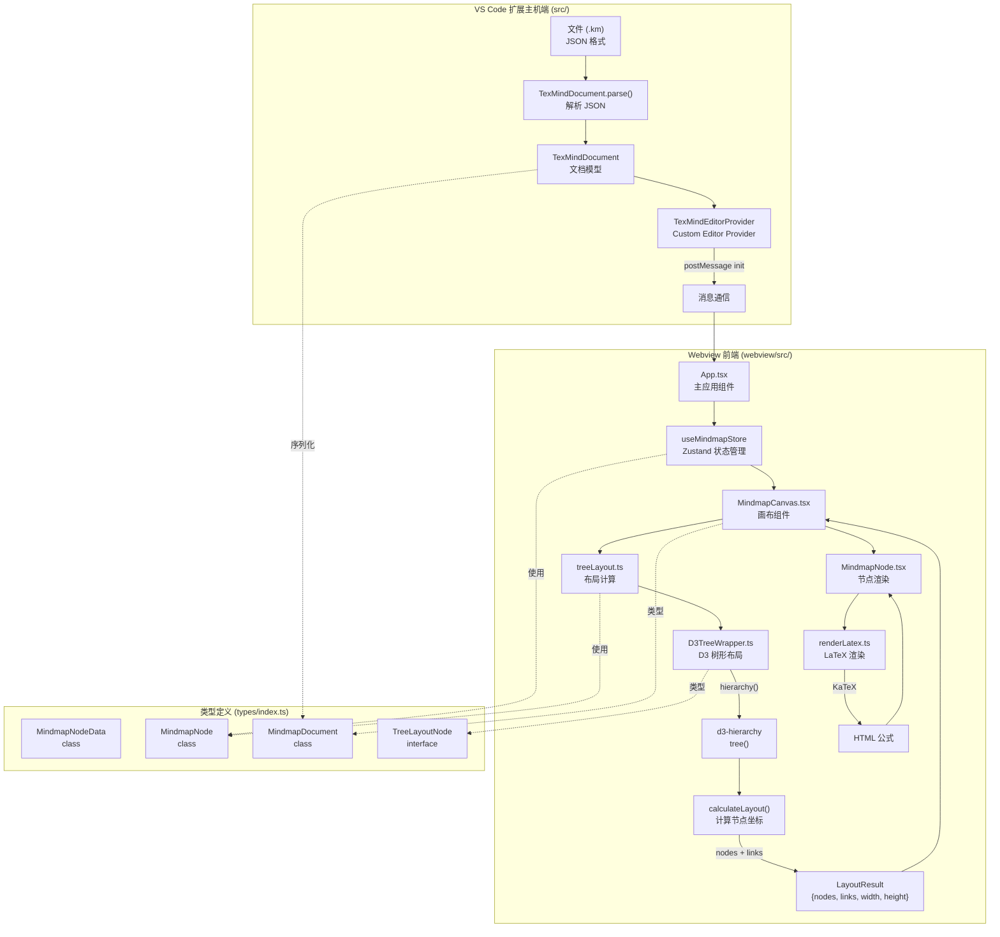
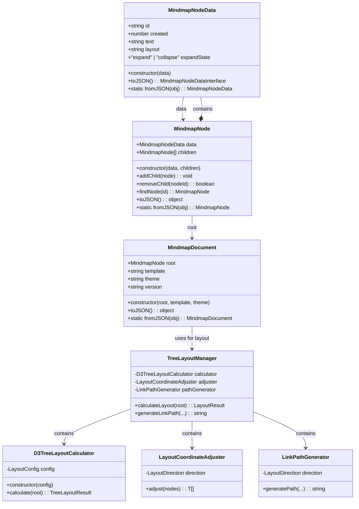
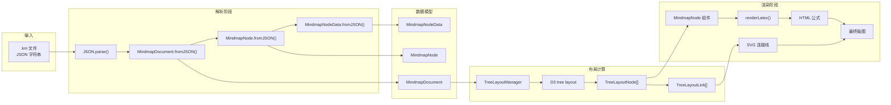
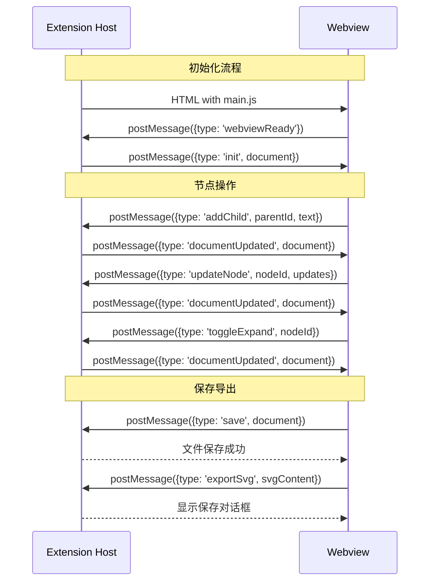

# LaTeX Mindmap 架构流程图

## 文件解析到渲染的完整流程



## 核心类交互关系



## 数据流向



## 消息通信协议



## 文件与类对应关系

```mermaid
erDiagram
    FILE ||--|| CLASS : defines
    
    "TexMindEditorProvider.ts" {
        class TexMindEditorProvider
    }
    
    "types/index.ts" {
        class MindmapNodeData
        class MindmapNode
        class MindmapDocument
        interface TreeLayoutNode
        interface LayoutConfig
    }
    
    "D3TreeWrapper.ts" {
        class D3TreeLayoutCalculator
        class LayoutCoordinateAdjuster
        class LinkPathGenerator
        class TreeLayoutManager
    }
    
    "treeLayout.ts" {
        function calculateTreeLayout
        function getLinkPath
    }
    
    "MindmapCanvas.tsx" {
        class MindmapCanvas
    }
    
    "App.tsx" {
        class App
    }
    
    "renderLatex.ts" {
        function renderLatex
        function sanitizeLatex
    }
    
    "mindmapStore.ts" {
        class MindmapStore
    }
    
    "TexMindDocument.ts" {
        class TexMindDocument
    }
    
    TexMindEditorProvider ||--|| TexMindDocument : uses
    TexMindEditorProvider ||--|| MindmapDocument : serializes
    MindmapCanvas ||--|| MindmapDocument : displays
    MindmapCanvas ||--|| TreeLayoutNode : positions
    MindmapCanvas ||--|| MindmapNode : renders
    MindmapCanvas ||--|| MindmapStore : reads state
    MindmapNode ||--|| renderLatex : renders text
    MindmapCanvas ||--|| treeLayout : calculates
    treeLayout ||--|| D3TreeWrapper : wraps
    D3TreeWrapper ||--|| MindmapNode : types
```
